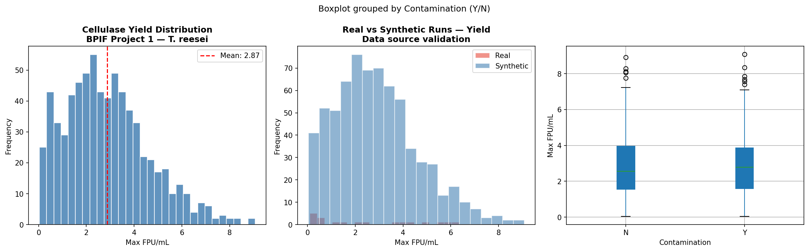
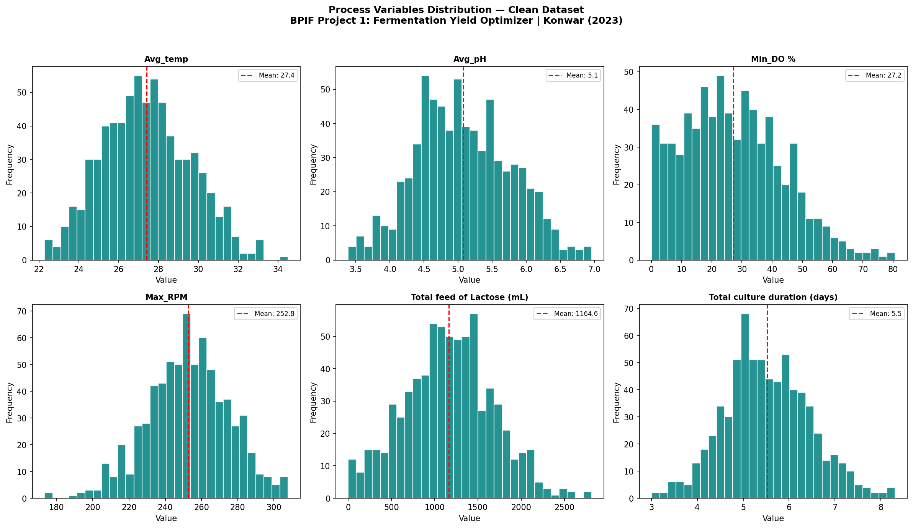
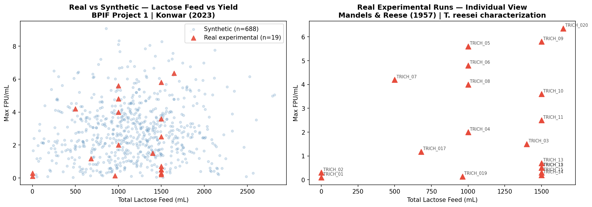
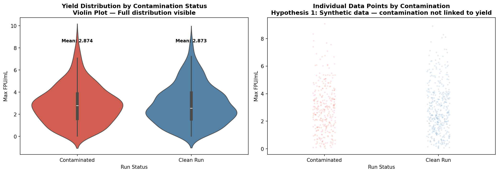
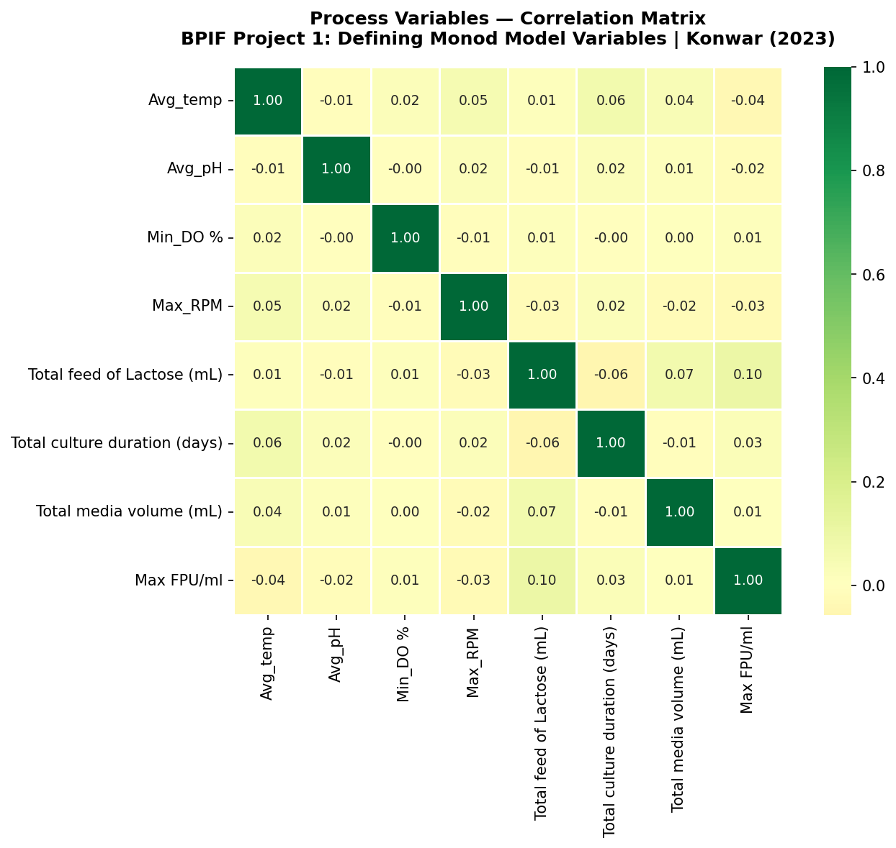
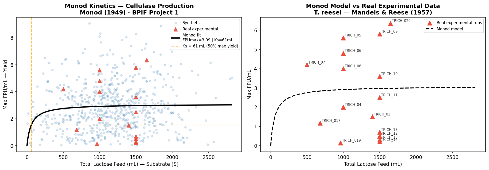
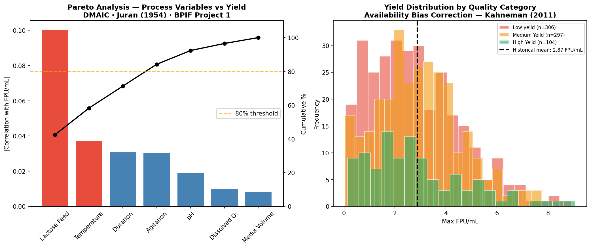
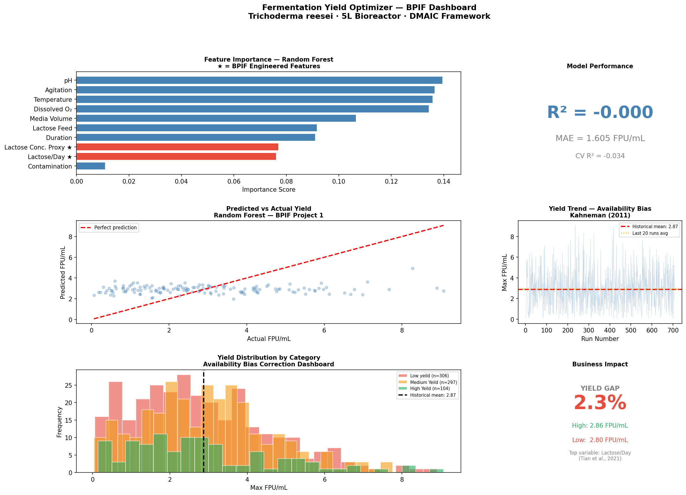

# Fermentation Yield Optimizer
### BioProcess Intelligence Framework — Project 1 of 7

---

## What this does / Qué hace

**EN:** Applies Monod kinetics and Random Forest to optimize cellulase
yield in *Trichoderma reesei* fermentation — and documents why
predictive modeling fails when critical variables are not measured.

**ES:** Aplica cinética de Monod y Random Forest para optimizar
rendimiento de celulasa en *Trichoderma reesei* — y documenta por qué
el modelado predictivo falla cuando faltan variables críticas de proceso.

---

## The problem it solves / El problema que resuelve

Fermentation yield variability costs producers consistency and revenue.
Operators adjust based on the last run, not historical patterns.
This project applies DMAIC to identify what drives yield —
and what data you actually need to predict it.

---

## Dataset

**Source:** Konwar, A.N. (2023). Kaggle — Fermentation Optimization
**Type:** Hybrid — 20 real bioreactor runs + 980 synthetic
**Organism:** *Trichoderma reesei* · cellulase production · 5L bioreactor
**Records after biotechnological cleaning:** 707 of 1,000

| Variable | Excluded | Scientific basis |
|---|---|---|
| Max FPU/ml | < 0 | Yield cannot be negative |
| Avg_pH | < 3 or > 7 | Outside *T. reesei* range (Ghose, 1987) |
| Avg_temp | < 22°C or > 35°C | Outside optimal range (Mandels & Reese, 1957) |
| Min_DO% | < 0 | Dissolved oxygen floor is 0% |
| Lactose feed | < 0 | Volume cannot be negative |

---

## How it works / Cómo funciona

Three scientific layers:

**1 — Data Engineering**
Real runs (n=19) flagged and tracked separately from synthetic
throughout all analyses. Contamination impact validated:
0.0% yield difference between contaminated and clean runs —
confirms synthetic data assigned contamination randomly.

**2 — Bioprocess Science**
Monod kinetics applied to lactose feed vs yield.
Result: FPUmax = 3.09 FPU/mL | Ks = 61 mL.
Critical finding: lactose recorded as total volume (mL),
not concentration (g/L). Monod requires [S] in g/L —
dataset limitation documented (Mandels et al., 1981).

Random Forest (200 trees, 10 variables including 2 engineered
features) returned R² = -0.000. This is a DMAIC Analyze phase
result: the available variables do not contain sufficient signal
to predict FPU/mL. Variables identified as missing: lactose
concentration (g/L), biomass (OD600), feeding rate (mL/h).

**3 — Behavioral Economics**
Dashboard corrects Availability Bias (Kahneman, 2011):
historical mean shown alongside last-run value so operators
don't adjust process based on isolated recent events.

---

## Results / Resultados

| Metric | Value |
|---|---|
| Clean records | 707 of 1,000 |
| Real runs retained | 19 of 20 |
| Monod FPUmax | 3.09 FPU/mL |
| Monod Ks | 61 mL lactose |
| Random Forest R² | -0.000 |
| Yield gap (High vs Low) | 2.3% |
| Contamination yield impact | 0.0% |

---

## Visualizations / Visualizaciones

---

## What's next / Versión 2

- Real fermentation data with [lactose] g/L + biomass measurements
- Full Monod calibration with true µmax and Ks
- Dataset author contacted via Kaggle Discussion for
  stock concentration data

---

## Stack

Python · pandas · scikit-learn · scipy · matplotlib · seaborn · Google Colab

---

## References

Bischof, R.H. et al. (2016). *Fungal Biology Reviews, 30*(2), 60–69.

Ghose, T.K. (1987). *Pure and Applied Chemistry, 59*(2), 257–268.

Kahneman, D. (2011). *Thinking, Fast and Slow.* Farrar, Straus and Giroux.

Mandels, M. & Reese, E.T. (1957). *Journal of Bacteriology, 73*(2), 269–278.

Mandels, M. et al. (1981). *Biotechnology and Bioengineering, 23*(9), 2009–2026.

Monod, J. (1949). *Annual Review of Microbiology, 3,* 371–394.

Tian, L. et al. (2021). *Bioresource Technology, 339,* 125627.

---

*Jesús Eduardo Reyes Jacinto · Ing. Bioquímico · M.Sc. Biotecnología · LSSBB*
*Acapulco, Guerrero, México*
